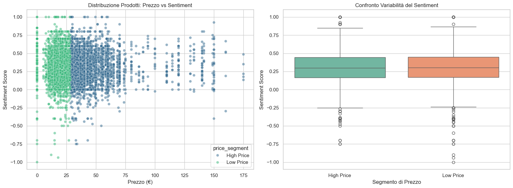

# Amazon E-commerce Analysis 📊
Analisi completa su 6.355 prodotti Amazon, focalizzata sulla redditività delle categorie e sulla Sentiment Analysis per guidare decisioni di investimento.

## 📂 Tabella dei contenuti
- [Descrizione](#-descrizione)
- [Obiettivi Finali](#-obiettivi-finali)
- [Technical Stack](#-technical-stack)
- [Notebook di Analisi](#-notebook-di-analisi)
- [Insight Strategici & BI](#-insight-strategici--business-intelligence)
- [Presentazione dei Risultati](#-presentazione-dei-risultati)
- [Installazione e Uso](#️-installazione-e-uso)
- [Struttura Dataset](#-struttura-dataset)
- [Pipeline dei dati (ETL)](#-pipeline-dei-dati-etl)
- [Contatti & Link](#-contatti--link)

## 📝 Descrizione
Questo progetto esplora un [dataset di Kaggle](https://www.kaggle.com/datasets/lazylad99/amazon-e-commerce-product-and-review-dataset?select=reviews.csv) contenente oltre 6.000 prodotti con l'obiettivo di identificare:
* **Investimenti sicuri**: Brand e categorie con alto volume di vendite e sentiment positivo.
* **Zone di rischio**: Segmenti di mercato con recensioni negative dove il capitale è a rischio.

👉 **[Clicca qui per visualizzare l'analisi completa (Jupyter Notebook)](./amazon.ipynb)**

## 🎯 Obiettivi Finali
* **Brand Insights**: Identificare dove investire (Sentiment +) e dove evitare (Sentiment -).
* **Performance Categorie**: Calcolo del fatturato totale e popolarità per categoria.
* **Product Analysis**: Analisi dei prodotti leader e degli "outlier" negativi.

## 🛠 Technical Stack

Il progetto utilizza le versioni più recenti delle librerie core per la Data Science (aggiornate al 2026) per garantire performance e stabilità.

*   **Linguaggi:** 
    *   Python 3.12+
    *   SQL (MariaDB / MySQL)
*   **Gestione Database:** [phpMyAdmin](https://www.phpmyadmin.net) (per lo storage iniziale, la pulizia e l'export dei dati).
*   **Qualità del Codice:** 
    *   [Ruff](https://github.com/astral-sh/ruff) (Linter & Formatter | standard PEP 8).
*   **Librerie Core:**
    *   `pandas` (v2.3.3) [[Doc](https://pandas.pydata.org)] — Manipolazione e analisi dei dati.
    *   `numpy` (v2.3.5) [[Doc](https://numpy.org)] — Calcoli numerici.
    *   `matplotlib` (v3.10.7) & `seaborn` (v0.13.2) — Data Visualization.
*   **Reporting:** Jupyter Notebook (v7.x) & Canva (Business Presentation).

## 📓 Notebook di Analisi
Il cuore del progetto è il notebook Jupyter, dove troverai la pulizia dei dati, la Sentiment Analysis e tutte le visualizzazioni grafiche:
- 📊 **[Visualizza il Notebook: amazon.ipynb](./amazon.ipynb)**

## 📈 Insight Strategici & Business Intelligence
Oltre alla gestione tecnica, l'analisi ha estratto valore decisionale dai dati:



### 1. Il Paradosso del Valore (Prezzo vs Sentiment)
L'analisi statistica ha rivelato che **un prezzo elevato non garantisce una maggiore soddisfazione**.
* **Soglia Mediana:** 28.41€.
* **Risultato:** Il segmento *Low Price* (0.310) mantiene un sentiment medio superiore al segmento *High Price* (0.305).
* **Business Insight:** I prodotti Premium affrontano aspettative più severe; il successo in questa fascia richiede un controllo qualità impeccabile.

### 2. Strategia di Investimento (Brand & Categorie)
* **Safe Haven:** Brand come **Wrangler** e **Under Armour** sono i benchmark di affidabilità (alto volume + sentiment costante).
* **Top Categories:** I segmenti **Baby** e **Boys** offrono il miglior equilibrio tra crescita e fidelizzazione del cliente.

## 📊 Presentazione dei Risultati
I risultati dell'analisi sono stati sintetizzati in una presentazione professionale rivolta a stakeholder e investitori.
👉 **[Scarica la Presentazione Completa (PDF)](./Amazon_Analysis_Anna_Rudych.pdf)**

## ⚙️ Installazione e Uso
1. **Prerequisiti:** Assicurati di avere Python 3.12+ installato.
2. **Clona la repository:**
   ```bash
   git clone https://github.com/annarudych/project_amazon.git
   cd project_amazon
   ```
3. **Installa le dipendenze**:
   ```bash
   pip install -r requirements.txt
   ```

## 📂 Struttura Dataset
- **Origine dati:** [Amazon Dataset su Kaggle](https://www.kaggle.com/datasets/lazylad99/amazon-e-commerce-product-and-review-dataset?select=reviews.csv)
- **I File CSV originali:** [`products.csv`](./csv/products.csv), [`reviews.csv`](./csv/reviews.csv)
- **File utilizzato:**: [`products_with_reviews_clean.csv`](./products_with_reviews_clean.csv)
- **Dimensioni:**: 12MB | 6,355 righe × 35 colonne

## 💾 Pipeline dei dati (ETL)
1. **Storage**: I dati grezzi sono stati strutturati in un database MariaDB.
2. **SQL Querying**: I dati sono stati filtrati e aggregati tramite query SQL via phpMyAdmin.
   * *Database Schema*: Il file SQL per ricreare la struttura del database è disponibile nella cartella principale [`amazon.sql`](./amazon.sql).
3. **Data Extraction:** Esportazione dei dati ottimizzati in formato CSV per l'analisi avanzata in Python.
4. **Analisi Python**: Pulizia finale in Python, sentiment analysis e visualizzazione finale.


## 👥 Contatti & Link
- **Data Analyst:** Anna Rudych
- **Email:** [annarudychw@gmail.com](mailto:annarudychw@gmail.com)
- **LinkedIn:** [Anna Rudych](https://www.linkedin.com/in/annarudych/)
- **GitHub:** [@annarudych](https://github.com/annarudych)
